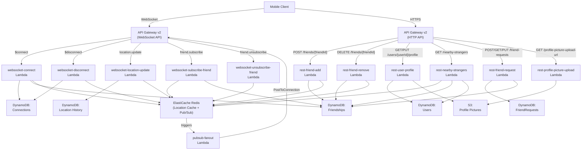

# Design Document: Nearby Friends

## Overview

The Nearby Friends feature is a serverless backend system enabling real-time location sharing between friends on a mobile application. Users who opt in share their location and see a list of friends who are geographically within a configurable radius (default 5 miles). Each nearby friend entry displays the friend's profile, straight-line Haversine distance, and last-updated timestamp.

The system is built on AWS with the following core services:
- **API Gateway v2 (WebSocket API)** — persistent bidirectional connections for real-time location updates and friend seeding
- **API Gateway v2 (HTTP API)** — stateless REST endpoints for friend management, user profiles, nearby strangers, and friend requests
- **AWS Lambda (12 handlers)** — one function per route/action, all VPC-deployed
- **Amazon DynamoDB (5 tables)** — Users, Friendships, Connections, Location History, FriendRequests
- **Amazon ElastiCache for Redis (cluster mode, Multi-AZ)** — Location Cache (with TTL) + Pub/Sub for real-time fan-out
- **Amazon S3** — profile picture storage with server-side encryption
- **AWS SSM Parameter Store** — configurable runtime parameters (search radius, TTL, limits)

Key design parameters (all configurable via SSM):
- Location update interval: 30 seconds
- Inactivity TTL: 600 seconds (10 minutes)
- Default search radius: 5 miles
- Max friends: 5,000
- Nearby strangers cap: 50
- Earth radius: 3,958.8 miles (Haversine)
- Consistency model: eventual consistency

## Architecture



### Request Flows

#### 1. WebSocket Connect ($connect)
1. Client opens WebSocket with `?token=<jwt>` → API Gateway routes `$connect` to `websocket-connect` Lambda
2. Authenticate user from token query parameter; reject connection on failure
3. Store `connectionId → userId` mapping in Connections table
4. Fetch user's full friend list from Friendships table
5. Batch-fetch friends' locations from Redis Location Cache (skip friends with no active entry)
6. Compute Haversine distance for each friend; filter to those within Search_Radius
7. Send `init.response` to client with array of nearby friend entries
8. Subscribe connection to all friends' Redis pub/sub channels (active and inactive)
9. Publish user's current location to their own Redis pub/sub channel

#### 2. WebSocket Disconnect ($disconnect)
1. API Gateway routes `$disconnect` to `websocket-disconnect` Lambda
2. Remove connection record from Connections table
3. Unsubscribe connection from all Redis pub/sub channels
4. Log errors but do not fail — TTL handles eventual cleanup

#### 3. Periodic Location Update (location.update)
1. Client sends `{ action: "location.update", latitude, longitude, timestamp }` every 30 seconds
2. Validate coordinates (lat ∈ [-90, 90], lng ∈ [-180, 180], timestamp present)
3. Write record to Location History table (fire-and-forget)
4. Update Location Cache in Redis with new coordinates + refresh TTL to Inactivity_TTL
5. Publish new location to user's own Redis pub/sub channel

#### 4. Pub/Sub Fan-Out
1. Redis pub/sub channel receives published location update
2. `pubsub-fanout` Lambda iterates all subscribers of that channel
3. For each subscriber: compute Haversine distance between subscriber and publisher
4. If within Search_Radius → send `location.push` via PostToConnection
5. If outside Search_Radius → skip silently
6. On PostToConnection failure → log error, continue with remaining subscribers

#### 5. Add Friend (POST /friends/{friendId})
1. Verify requester's friend count < max_friends limit
2. Write two bidirectional Friendship records (userId→friendId, friendId→userId)
3. Subscribe requester's WebSocket connection to new friend's Redis pub/sub channel
4. Return friend's last known location from cache if active; otherwise success without location

#### 6. Remove Friend (DELETE /friends/{friendId})
1. Delete both bidirectional Friendship records
2. Unsubscribe requester's connection from removed friend's Redis pub/sub channel
3. Return success

#### 7. Friend Subscribe / Unsubscribe (Opt-In / Opt-Out)
- `friend.subscribe`: Subscribe connection to specified friend's Redis channel (verify friendship exists)
- `friend.unsubscribe`: Unsubscribe connection from specified friend's Redis channel

#### 8. User Profile (GET/PUT /users/{userId}/profile)
- GET: Retrieve profile from Users table; if profilePictureKey exists, generate pre-signed GET URL from S3
- PUT: Update displayName, profilePictureKey, and/or discoverable flag in Users table

#### 9. Profile Picture Upload (GET /users/{userId}/profile-picture-upload-url)
- Generate pre-signed S3 PUT URL with unique key and time-limited expiration
- Client uploads directly to S3, then calls PUT /profile to save the key

#### 10. Nearby Strangers (GET /nearby-strangers)
1. Query all active users from Redis Location Cache
2. Compute Haversine distance; filter to within Search_Radius
3. Exclude requesting user and all existing friends (Friendships table lookup)
4. Include only users with `discoverable = true` (Users table lookup)
5. Cap results to configured limit (default 50)
6. Return list with userId, displayName, profilePictureUrl (pre-signed), distanceMiles

#### 11. Friend Request Lifecycle
- **Send** (POST /friend-requests/{toUserId}): Create pending request in FriendRequests table; reject duplicates and existing friends
- **List** (GET /friend-requests): Query by toUserId GSI for pending incoming requests
- **Accept** (PUT /friend-requests/{requestId}/accept): Verify pending status → create bidirectional Friendship records → delete request → trigger subscribe flows
- **Decline** (PUT /friend-requests/{requestId}/decline): Verify pending status → delete request record

### Design Decisions

- **12 separate Lambda handlers** — one per route/action for independent deployment, scaling, and least-privilege IAM
- **ElastiCache Redis for Location Cache + Pub/Sub** — sub-millisecond reads for location lookups; native pub/sub for real-time fan-out without polling DynamoDB
- **DynamoDB for persistent state** — on-demand billing, automatic scaling, TTL support for Connections cleanup
- **Dual-write on location update** — Location History (DynamoDB, permanent) for ML + Location Cache (Redis, TTL) for real-time queries
- **Redis TTL for inactivity** — no explicit "offline" event needed; expired cache entries = inactive users
- **Bidirectional friendship records** — enables O(1) lookup in both directions without complex queries
- **S3 pre-signed URLs** — client uploads directly to S3, avoiding Lambda payload limits for binary data
- **SSM Parameter Store** — runtime-configurable parameters without redeployment

## Components and Interfaces

### Lambda Handlers

#### `websocket-connect(event) → response`
- **Trigger**: API Gateway `$connect` route
- **Input**: `event.requestContext.connectionId`, `event.queryStringParameters.token`
- **Behavior**: Authenticate token → store connection → fetch friends → batch-fetch locations from Redis → compute Haversine → send `init.response` → subscribe to all friends' channels → publish own location
- **Output**: `{ statusCode: 200 }` on success; `{ statusCode: 401 }` on auth failure; `{ statusCode: 500 }` on storage failure
- **AWS Dependencies**: DynamoDB (Connections, Friendships), Redis (Location Cache, Pub/Sub), API Gateway Management API

#### `websocket-disconnect(event) → response`
- **Trigger**: API Gateway `$disconnect` route
- **Input**: `event.requestContext.connectionId`
- **Behavior**: Remove connection record from Connections table → unsubscribe from all Redis pub/sub channels → log errors gracefully
- **Output**: `{ statusCode: 200 }` (always succeeds from client perspective)
- **AWS Dependencies**: DynamoDB (Connections), Redis (Pub/Sub)

#### `websocket-location-update(event) → response`
- **Trigger**: API Gateway `location.update` route
- **Input**: `event.requestContext.connectionId`, `event.body` (JSON: `{ action, latitude, longitude, timestamp }`)
- **Behavior**: Validate coordinates → write to Location History (fire-and-forget) → update Redis Location Cache with TTL → publish to user's Redis pub/sub channel
- **Output**: `{ statusCode: 200 }` on success; error message to client on validation failure
- **AWS Dependencies**: DynamoDB (Location History, Connections), Redis (Location Cache, Pub/Sub)

#### `websocket-subscribe-friend(event) → response`
- **Trigger**: API Gateway `friend.subscribe` route
- **Input**: `event.body` (JSON: `{ action, friendId }`)
- **Behavior**: Verify friendship exists in Friendships table → subscribe connection to friend's Redis pub/sub channel
- **Output**: Success acknowledgment or error if friendship doesn't exist
- **AWS Dependencies**: DynamoDB (Friendships), Redis (Pub/Sub)

#### `websocket-unsubscribe-friend(event) → response`
- **Trigger**: API Gateway `friend.unsubscribe` route
- **Input**: `event.body` (JSON: `{ action, friendId }`)
- **Behavior**: Unsubscribe connection from friend's Redis pub/sub channel
- **Output**: Success acknowledgment
- **AWS Dependencies**: Redis (Pub/Sub)

#### `pubsub-fanout(event) → void`
- **Trigger**: Redis pub/sub message on a user's location channel
- **Input**: Published location message (userId, latitude, longitude, timestamp)
- **Behavior**: Iterate all subscribers → for each, fetch subscriber's location from Redis → compute Haversine → if within radius, send `location.push` via PostToConnection → on failure, log and continue
- **Output**: None (fire-and-forget fan-out)
- **AWS Dependencies**: Redis (Pub/Sub, Location Cache), API Gateway Management API, SSM (Search_Radius)

#### `rest-friend-add(event) → response`
- **Trigger**: HTTP API `POST /friends/{friendId}`
- **Input**: `event.pathParameters.friendId`, authenticated userId from context
- **Behavior**: Check friend count < max_friends → write two bidirectional Friendship records → subscribe to friend's Redis channel → return friend's cached location if active
- **Output**: `{ statusCode: 200, body: { location? } }` or `{ statusCode: 409 }` on limit exceeded
- **AWS Dependencies**: DynamoDB (Friendships), Redis (Pub/Sub, Location Cache), SSM (max_friends)

#### `rest-friend-remove(event) → response`
- **Trigger**: HTTP API `DELETE /friends/{friendId}`
- **Input**: `event.pathParameters.friendId`, authenticated userId from context
- **Behavior**: Delete both bidirectional Friendship records → unsubscribe from friend's Redis channel
- **Output**: `{ statusCode: 200 }`
- **AWS Dependencies**: DynamoDB (Friendships), Redis (Pub/Sub)

#### `rest-user-profile(event) → response`
- **Trigger**: HTTP API `GET /users/{userId}/profile` or `PUT /users/{userId}/profile`
- **Input**: `event.pathParameters.userId`, `event.body` (for PUT: `{ displayName?, profilePictureKey?, discoverable? }`)
- **Behavior**:
  - GET: Fetch profile from Users table → generate pre-signed GET URL for profile picture if key exists → return profile
  - PUT: Update specified fields in Users table
- **Output**: `{ statusCode: 200, body: profile }` or `{ statusCode: 404 }` on not found
- **AWS Dependencies**: DynamoDB (Users), S3 (Profile Pictures), `@aws-sdk/s3-request-presigner`

#### `rest-nearby-strangers(event) → response`
- **Trigger**: HTTP API `GET /nearby-strangers`
- **Input**: Authenticated userId from context
- **Behavior**: Fetch all active locations from Redis → compute Haversine distances → filter within radius → exclude self and friends → filter discoverable users → cap results → generate pre-signed profile picture URLs → return list
- **Output**: `{ statusCode: 200, body: NearbyStrangerEntry[] }`
- **AWS Dependencies**: Redis (Location Cache), DynamoDB (Friendships, Users), S3 (pre-signed URLs), SSM (Search_Radius, nearby_strangers_limit)

#### `rest-friend-request(event) → response`
- **Trigger**: HTTP API routes for `/friend-requests`
- **Input**: Varies by operation (POST: toUserId; GET: authenticated userId; PUT: requestId + action)
- **Behavior**:
  - POST /friend-requests/{toUserId}: Check for duplicate/existing friendship → create pending request
  - GET /friend-requests: Query by toUserId GSI → return pending requests
  - PUT /friend-requests/{requestId}/accept: Verify pending → create friendships → delete request → trigger subscribes
  - PUT /friend-requests/{requestId}/decline: Verify pending → delete request
- **Output**: Appropriate status codes and response bodies per operation
- **AWS Dependencies**: DynamoDB (FriendRequests, Friendships), Redis (Pub/Sub for accept flow)

#### `rest-profile-picture-upload(event) → response`
- **Trigger**: HTTP API `GET /users/{userId}/profile-picture-upload-url`
- **Input**: `event.pathParameters.userId`
- **Behavior**: Generate unique S3 key → create pre-signed PUT URL with expiration
- **Output**: `{ statusCode: 200, body: { uploadUrl, s3Key } }`
- **AWS Dependencies**: S3 (Profile Pictures), `@aws-sdk/s3-request-presigner`

### Utility Modules

#### `distance.ts` — Haversine Formula
```typescript
function haversine(lat1: number, lng1: number, lat2: number, lng2: number): number
```
Pure function. Accepts latitude/longitude in decimal degrees. Returns great-circle distance in miles using Earth radius = 3,958.8 miles.

Formula: `a = sin²(Δlat/2) + cos(lat1) · cos(lat2) · sin²(Δlng/2)`, `c = 2 · atan2(√a, √(1−a))`, `distance = R · c`

#### `redis-client.ts` — ElastiCache Redis Singleton
- `getLocationCache(userId: string): Promise<LocationCacheEntry | null>`
- `setLocationCache(userId: string, entry: LocationCacheEntry, ttlSeconds: number): Promise<void>`
- `getAllActiveLocations(): Promise<LocationCacheEntry[]>`
- `publish(channel: string, message: string): Promise<void>`
- `subscribe(channel: string, connectionId: string): Promise<void>`
- `unsubscribe(channel: string, connectionId: string): Promise<void>`
- `unsubscribeAll(connectionId: string): Promise<void>`

#### `dynamo-client.ts` — DynamoDB DocumentClient Singleton
Provides typed wrappers around DynamoDB operations for all five tables.

#### `apigw-client.ts` — API Gateway Management API Client
- `postToConnection(connectionId: string, data: object): Promise<void>`

#### `s3-client.ts` — S3 Client + Pre-Signed URL Helpers
- `generateUploadUrl(userId: string): Promise<{ uploadUrl: string, s3Key: string }>`
- `generateDownloadUrl(s3Key: string): Promise<string>`

## Data Models

### DynamoDB Tables

#### Users Table
| Attribute | Type | Key | Description |
|---|---|---|---|
| `userId` | String | PK | Unique user identifier |
| `displayName` | String | — | User's display name |
| `profilePictureKey` | String | — | S3 object key for profile picture (optional) |
| `discoverable` | Boolean | — | Whether user appears in nearby strangers results |
| `createdAt` | String | — | ISO 8601 creation timestamp |

#### Friendships Table
| Attribute | Type | Key | Description |
|---|---|---|---|
| `userId` | String | PK | The user who owns this friendship record |
| `friendId` | String | SK | The friend's user ID |
| `createdAt` | String | — | ISO 8601 creation timestamp |

**GSI**: `friendId-index` on `friendId` — enables reverse lookup (who has me as a friend).

#### Connections Table
| Attribute | Type | Key | Description |
|---|---|---|---|
| `connectionId` | String | PK | API Gateway WebSocket connection ID |
| `userId` | String | — | The authenticated user's ID |
| `connectedAt` | String | — | ISO 8601 connection timestamp |

**GSI**: `userId-index` on `userId` — enables lookup of a user's active connections.

#### Location History Table
| Attribute | Type | Key | Description |
|---|---|---|---|
| `userId` | String | PK | The user's ID |
| `timestamp` | String | SK | ISO 8601 timestamp of the location update |
| `latitude` | Number | — | Latitude (-90 to 90) |
| `longitude` | Number | — | Longitude (-180 to 180) |

No TTL — records retained indefinitely for future ML use.

#### FriendRequests Table
| Attribute | Type | Key | Description |
|---|---|---|---|
| `requestId` | String | PK | Unique request identifier (UUID) |
| `fromUserId` | String | — | The user who sent the request |
| `toUserId` | String | — | The user who received the request |
| `status` | String | — | "pending", "accepted", or "declined" |
| `createdAt` | String | — | ISO 8601 creation timestamp |

**GSI 1**: `toUserId-index` on `toUserId` — list incoming requests.
**GSI 2**: `fromUserId-index` on `fromUserId` — list outgoing requests.

### Redis Data Structures

#### Location Cache
- **Key pattern**: `location:{userId}`
- **Value**: JSON string `{ userId, latitude, longitude, timestamp }`
- **TTL**: Configurable Inactivity_TTL (default 600 seconds)
- Refreshed on every location update

#### Pub/Sub Channels
- **Channel pattern**: `location-channel:{userId}`
- Each user has their own channel; friends subscribe to it
- Messages: JSON `{ userId, latitude, longitude, timestamp }`

### WebSocket Message Schemas

#### Client → Backend: Location Update
```json
{
  "action": "location.update",
  "latitude": 40.7128,
  "longitude": -74.0060,
  "timestamp": "2024-01-15T10:30:00.000Z"
}
```

#### Client → Backend: Friend Subscribe
```json
{
  "action": "friend.subscribe",
  "friendId": "user-456"
}
```

#### Client → Backend: Friend Unsubscribe
```json
{
  "action": "friend.unsubscribe",
  "friendId": "user-456"
}
```

#### Backend → Client: Location Push
```json
{
  "type": "location.push",
  "friendId": "user-456",
  "latitude": 40.7130,
  "longitude": -74.0055,
  "lastUpdated": "2024-01-15T10:30:00.000Z",
  "distanceMiles": 0.12
}
```

#### Backend → Client: Init Response
```json
{
  "type": "init.response",
  "friends": [
    {
      "friendId": "user-456",
      "latitude": 40.7130,
      "longitude": -74.0055,
      "lastUpdated": "2024-01-15T10:30:00.000Z",
      "distanceMiles": 0.12
    }
  ]
}
```

### REST API Response Schemas

#### GET /users/{userId}/profile
```json
{
  "userId": "user-123",
  "displayName": "Jane Doe",
  "profilePictureUrl": "https://s3.amazonaws.com/...",
  "discoverable": true,
  "createdAt": "2024-01-01T00:00:00.000Z"
}
```

#### GET /nearby-strangers
```json
[
  {
    "userId": "user-789",
    "displayName": "John Smith",
    "profilePictureUrl": "https://s3.amazonaws.com/...",
    "distanceMiles": 2.3
  }
]
```

#### POST /friend-requests/{toUserId}
```json
{
  "requestId": "req-abc-123",
  "fromUserId": "user-123",
  "toUserId": "user-789",
  "status": "pending",
  "createdAt": "2024-01-15T10:30:00.000Z"
}
```

### TypeScript Interfaces

```typescript
// Location types
interface LocationUpdate {
  userId: string;
  latitude: number;
  longitude: number;
  timestamp: string;
}

interface LocationCacheEntry extends LocationUpdate {}

interface LocationHistoryRecord extends LocationUpdate {}

// User types
interface UserProfile {
  userId: string;
  displayName: string;
  profilePictureKey?: string;
  discoverable: boolean;
  createdAt: string;
}

// Friendship types
interface Friendship {
  userId: string;
  friendId: string;
  createdAt: string;
}

// Friend request types
interface FriendRequest {
  requestId: string;
  fromUserId: string;
  toUserId: string;
  status: 'pending' | 'accepted' | 'declined';
  createdAt: string;
}

// Connection types
interface WebSocketConnection {
  connectionId: string;
  userId: string;
  connectedAt: string;
}

// Response types
interface NearbyFriendEntry {
  friendId: string;
  latitude: number;
  longitude: number;
  lastUpdated: string;
  distanceMiles: number;
}

interface NearbyStrangerEntry {
  userId: string;
  displayName: string;
  profilePictureUrl: string;
  distanceMiles: number;
}

// WebSocket message types
interface LocationUpdateMessage {
  action: 'location.update';
  latitude: number;
  longitude: number;
  timestamp: string;
}

interface LocationPushMessage {
  type: 'location.push';
  friendId: string;
  latitude: number;
  longitude: number;
  lastUpdated: string;
  distanceMiles: number;
}

interface InitResponseMessage {
  type: 'init.response';
  friends: NearbyFriendEntry[];
}

interface FriendSubscribeMessage {
  action: 'friend.subscribe';
  friendId: string;
}

interface FriendUnsubscribeMessage {
  action: 'friend.unsubscribe';
  friendId: string;
}
```


## Correctness Properties

*A property is a characteristic or behavior that should hold true across all valid executions of a system — essentially, a formal statement about what the system should do. Properties serve as the bridge between human-readable specifications and machine-verifiable correctness guarantees.*

### Property 1: Connection record storage

*For any* valid connectionId and authenticated userId, after the websocket-handler processes the connection event, the Connections_Table shall contain a record mapping that connectionId to that userId.

**Validates: Requirement 1.4**

### Property 2: Disconnect removes connection

*For any* active WebSocket connection, after the websocket-handler processes the disconnect event, the Connections_Table shall no longer contain that connectionId.

**Validates: Requirement 2.1**

### Property 3: Coordinate validation

*For any* pair of numeric values (lat, lng) and an optional timestamp, the validation function shall accept the input if and only if lat is in the range [-90, 90], lng is in the range [-180, 180], and a valid timestamp is present. All other inputs (out of range, non-numeric, missing fields) shall be rejected.

**Validates: Requirements 3.2, 3.4**

### Property 4: Location update writes to Connections_Table with TTL

*For any* valid location update with userId, latitude, longitude, and timestamp, after the websocket-handler processes it, the user's record in the Connections_Table shall contain those exact coordinate values and the TTL attribute shall be set to the current time plus the configured Inactivity_TTL.

**Validates: Requirements 3.3, 6.2**

### Property 5: Haversine distance mathematical properties

*For any* two valid geographic coordinate pairs (lat1, lng1) and (lat2, lng2) where lat ∈ [-90, 90] and lng ∈ [-180, 180], the Haversine function shall satisfy: (a) distance is always non-negative, (b) haversine(a, b) equals haversine(b, a) (symmetry), and (c) haversine(a, a) equals 0 (identity).

**Validates: Requirement 5.1**

### Property 6: Nearby classification matches distance comparison

*For any* two valid geographic coordinate pairs and any positive search radius, the system shall classify a user as "nearby" if and only if the Haversine distance between the two points is less than or equal to the radius. This applies uniformly to init.response filtering, DynamoDB Streams fan-out notifications, and nearby strangers queries.

**Validates: Requirements 1.7, 4.5, 4.6, 5.3, 5.4**

### Property 7: Inactive user exclusion from nearby results

*For any* user whose Connections_Table record has expired or is absent, that user shall not appear in any nearby friend results (init.response), location.push notifications, or nearby strangers results.

**Validates: Requirements 6.3**

### Property 8: Fan-out notifies all nearby friends

*For any* DynamoDB Streams event triggered by a location update for user U with N friends, the fanout-handler shall evaluate the Haversine distance for all N friends with active connections — sending location.push to those within the Search_Radius and skipping those outside it.

**Validates: Requirements 4.2, 4.3, 4.4, 4.5, 4.6**

### Property 9: Init response contains exactly the nearby friends

*For any* connecting user with a friend list and a set of friends with active Connections_Table records, the init.response message shall contain one entry for each friend within the configured Search_Radius, and each entry shall include friendId, latitude, longitude, lastUpdated, and distanceMiles. Friends outside the radius or without active connection records shall not appear.

**Validates: Requirements 1.7, 1.8**

### Property 10: Friendship bidirectionality on accept

*For any* accepted friend request between userId A and userId B, after the accept operation completes, the Friendships_Table shall contain both the record (A, B) and the record (B, A).

**Validates: Requirement 13.5**

### Property 11: Friendship bidirectionality on remove

*For any* valid remove-friend operation between userId A and friendId B, after the operation completes, the Friendships_Table shall contain neither the record (A, B) nor the record (B, A).

**Validates: Requirement 7.1**

### Property 12: Friend count limit enforcement on accept

*For any* friend request acceptance where either user's current friend count equals or exceeds the configured maximum (default 5,000), the accept operation shall be rejected with an error. For any acceptance where both users are below the maximum, the operation shall succeed.

**Validates: Requirements 13.3, 13.4**

### Property 13: Profile update round-trip

*For any* valid user profile with displayName, profilePictureKey, and discoverable flag, updating the profile via PUT and then retrieving it via GET shall return the same values that were written.

**Validates: Requirements 8.1, 8.3**

### Property 14: Profile picture URL generation

*For any* user profile that includes a profilePictureKey, the GET profile response shall include a non-empty profilePictureUrl (pre-signed URL). For any profile without a profilePictureKey, the response shall not include a profilePictureUrl.

**Validates: Requirement 8.2**

### Property 15: Discoverable flag independence

*For any* user profile, toggling the discoverable flag via PUT /profile shall not affect the user's connection or location state in the Connections_Table, and updating location shall not affect the discoverable flag value in the Users_Table.

**Validates: Requirement 8.4**

### Property 16: Upload URL uniqueness

*For any* two calls to generate a profile picture upload URL (even for the same userId), the returned S3 keys shall be distinct.

**Validates: Requirement 9.1**

### Property 17: Nearby strangers filtering

*For any* set of active users in the Connections_Table, the nearby-strangers endpoint shall return only users who satisfy all of: (a) within the configured Search_Radius of the requester, (b) not the requester themselves, (c) not an existing friend of the requester, and (d) have discoverable set to true in the Users_Table. Each returned entry shall contain userId, displayName, profilePictureUrl, and distanceMiles.

**Validates: Requirements 10.2, 10.3, 10.4, 10.5**

### Property 18: Nearby strangers ordering by proximity

*For any* nearby-strangers query result with multiple entries, the entries shall be ordered by distanceMiles ascending (closest first).

**Validates: Requirement 10.5**

### Property 19: Nearby strangers result cap

*For any* nearby-strangers query result, the number of returned entries shall not exceed the configured limit (default 50) read from SSM Parameter Store, regardless of how many users satisfy the filtering criteria.

**Validates: Requirement 10.6**

### Property 20: Friend request creation and listing round-trip

*For any* valid friend request from user A to user B (where no pending request or existing friendship exists), after creation, querying pending incoming requests for user B shall include a record with the correct requestId, fromUserId equal to A, status "pending", and a createdAt timestamp.

**Validates: Requirements 11.1, 12.1, 12.2**

### Property 21: Friend request deletion on resolution

*For any* pending friend request, after either accepting or declining it, the FriendRequests_Table shall no longer contain that request record.

**Validates: Requirements 13.6, 14.3**

### Property 22: SSM parameters with defaults

*For any* SSM parameter path in the set {search-radius-miles, inactivity-ttl-seconds, location-update-interval-seconds, max-friends, nearby-strangers-limit}, when the parameter exists in SSM Parameter Store, the system shall use its value; when the parameter does not exist, the system shall use the configured default (5, 600, 30, 5000, 50 respectively).

**Validates: Requirements 15.1, 15.2, 15.3, 15.4, 15.5**

### Property 23: Message serialization round-trip

*For any* valid LocationUpdateMessage, LocationPushMessage, or InitResponseMessage object, serializing to JSON and then parsing back shall produce an object equivalent to the original.

**Validates: Requirements 16.4, 16.5, 16.6**

## Error Handling

### Connection Errors (websocket-connect)
- **Authentication failure**: Return `{ statusCode: 401 }` to reject the WebSocket connection. (Req 1.3)
- **DynamoDB PutItem failure on connection storage**: Return `{ statusCode: 500 }` to reject the connection. Client should retry. (Req 1.11)
- **Redis batch-fetch failure**: Log error, send `init.response` with empty friends array. Connection still established.
- **PostToConnection failure for init.response**: Log error. Client can request refresh on next location update.

### Disconnection Errors (websocket-disconnect)
- **DynamoDB DeleteItem failure**: Log error, return `{ statusCode: 200 }`. Redis TTL and DynamoDB TTL handle eventual cleanup. (Req 2.3)
- **Redis unsubscribe failure**: Log error, continue. Stale subscriptions are harmless — messages to dead connections are caught by fan-out error handling.

### Location Update Errors (websocket-location-update)
- **Invalid coordinates**: Send error message to client via PostToConnection specifying which field failed validation. (Req 3.6)
- **Invalid JSON body**: Send error message to client with parse failure details.
- **Location History write failure**: Log error, continue (fire-and-forget). Cache update and pub/sub still proceed. (Req 20.2)
- **Redis cache update failure**: Log error, send error to client. Location History write may still succeed.
- **Redis publish failure**: Log error. Subscribers won't receive this update; next update in 30 seconds will retry implicitly.

### Fan-Out Errors (pubsub-fanout)
- **PostToConnection failure (stale connection)**: Log error, optionally clean up stale connection record, continue with remaining subscribers. (Req 4.5)
- **PostToConnection failure (transient)**: Log error, continue. Next location update cycle retries implicitly.
- **Redis Location Cache read failure for subscriber**: Log error, skip subscriber. Continue with remaining.

### REST API Errors
- **Friend add — limit exceeded**: Return `{ statusCode: 409, body: { error: "Friend limit reached" } }`. (Req 7.2)
- **Friend add — DynamoDB write failure**: Return `{ statusCode: 500 }`. No partial writes — use DynamoDB TransactWriteItems for atomicity.
- **Friend remove — record not found**: Return `{ statusCode: 404 }`.
- **Profile GET — user not found**: Return `{ statusCode: 404 }`. (Req 11.5)
- **Profile PUT — validation failure**: Return `{ statusCode: 400 }` with field-level errors.
- **Nearby strangers — Redis failure**: Return `{ statusCode: 500 }`.
- **Friend request — duplicate**: Return `{ statusCode: 409, body: { error: "Duplicate request" } }`. (Req 14.2)
- **Friend request — already friends**: Return `{ statusCode: 409, body: { error: "Already friends" } }`. (Req 14.3)
- **Friend request accept/decline — not found or not pending**: Return `{ statusCode: 404 }` or `{ statusCode: 409 }`. (Req 16.2, 17.2)

### General Strategy
- All Lambda handlers use try/catch at the top level to prevent unhandled exceptions
- Errors are logged with structured JSON (requestId, connectionId, userId, error message, timestamp) for CloudWatch
- Fan-out loops wrap each iteration independently — one failure does not block others
- DynamoDB TransactWriteItems used for operations requiring atomicity (bidirectional friendship writes)
- Fire-and-forget operations (Location History writes) do not block the critical path

## Testing Strategy

### Dual Testing Approach

This feature uses both unit tests and property-based tests for comprehensive coverage.

- **Unit tests**: Verify specific examples, edge cases, error conditions, and integration points between components.
- **Property-based tests**: Verify universal properties across randomly generated inputs with minimum 100 iterations per test.

Both are complementary — unit tests catch concrete bugs and document expected behavior, while property tests verify general correctness across the input space. Avoid writing excessive unit tests; property-based tests handle broad input coverage.

### Property-Based Testing Configuration

- **Library**: [fast-check](https://github.com/dubzzz/fast-check) for TypeScript/Node.js
- **Minimum iterations**: 100 per property test
- **Each property test must reference its design document property with a tag comment**
- **Tag format**: `Feature: nearby-friends, Property {number}: {property_text}`
- **Each correctness property is implemented by a single property-based test**

### Unit Test Coverage

Unit tests should focus on:
- **Specific examples**: Known coordinate pairs with pre-computed Haversine distances (e.g., NYC to LA)
- **Edge cases**: Coordinates at boundaries (-90, 90, -180, 180), antipodal points, same location, equator/prime meridian crossings
- **Error conditions**: DynamoDB failures (mocked), Redis failures (mocked), invalid JSON, missing fields, stale connections, duplicate friend requests, friend limit exceeded
- **Integration points**: Handler orchestration with mocked DynamoDB, Redis, API Gateway, S3, and SSM clients
- **Auth flows**: Token validation success/failure on WebSocket connect

### Property Test Coverage

Each correctness property (Properties 1–25) maps to a single property-based test:

| Property | Test Description | Generator Strategy |
|---|---|---|
| 1 | Connection record storage | Random connectionId (uuid), userId (string), valid token |
| 2 | Disconnect cleanup | Random pre-populated connection + subscriptions |
| 3 | Coordinate validation | Random numbers (valid and invalid ranges), random strings, missing fields |
| 4 | Location dual-write | Random valid coordinates, userId, ISO timestamp |
| 5 | Cache TTL refresh | Random valid location updates with configurable TTL values |
| 6 | Haversine mathematical properties | Random lat ∈ [-90,90], lng ∈ [-180,180] pairs |
| 7 | Nearby classification | Random coordinate pairs + random positive radius values |
| 8 | Inactive user exclusion | Random friend lists with mix of active/expired cache entries |
| 9 | Fan-out completeness | Random channel with random subscriber list and locations |
| 10 | Init response correctness | Random user with random friends at random locations + radius |
| 11 | Connect subscribes all friends | Random user with random-length friend list (0 to 100) |
| 12 | Friendship bidirectionality — add | Random userId pairs |
| 13 | Friendship bidirectionality — remove | Random pre-existing friendship pairs |
| 14 | Friend count limit | Random friend counts near the configurable limit boundary |
| 15 | Subscribe/unsubscribe round-trip | Random friendships + connection states |
| 16 | Profile update round-trip | Random displayName, profilePictureKey, discoverable values |
| 17 | Profile picture URL generation | Random profiles with/without profilePictureKey |
| 18 | Discoverable independence | Random profile states + subscription states |
| 19 | Upload URL uniqueness | Random userId, multiple invocations |
| 20 | Nearby strangers filtering | Random active users, friend lists, discoverable flags, locations |
| 21 | Nearby strangers cap | Random large sets of qualifying strangers + configurable cap |
| 22 | Friend request round-trip | Random user pairs, request creation + listing |
| 23 | Request deletion on resolution | Random pending requests, accept/decline actions |
| 24 | SSM parameters with defaults | Random parameter presence/absence + random values |
| 25 | Message serialization round-trip | Random valid LocationUpdate, LocationPush, InitResponse objects |

### Test Organization

```
tests/
├── unit/
│   ├── distance.test.ts                    # Haversine specific examples + edge cases
│   ├── validation.test.ts                  # Coordinate validation edge cases
│   ├── websocket-connect.test.ts           # Connect handler with mocked deps
│   ├── websocket-disconnect.test.ts        # Disconnect handler with mocked deps
│   ├── websocket-location-update.test.ts   # Location update handler with mocked deps
│   ├── websocket-subscribe-friend.test.ts  # Subscribe handler with mocked deps
│   ├── websocket-unsubscribe-friend.test.ts # Unsubscribe handler with mocked deps
│   ├── pubsub-fanout.test.ts               # Fan-out handler with mocked deps
│   ├── rest-friend-add.test.ts             # Add friend handler with mocked deps
│   ├── rest-friend-remove.test.ts          # Remove friend handler with mocked deps
│   ├── rest-user-profile.test.ts           # Profile GET/PUT with mocked deps
│   ├── rest-nearby-strangers.test.ts       # Nearby strangers with mocked deps
│   ├── rest-friend-request.test.ts         # Friend request lifecycle with mocked deps
│   └── rest-profile-picture-upload.test.ts # Upload URL generation with mocked deps
└── property/
    ├── connection.property.test.ts          # Properties 1, 2, 11
    ├── validation.property.test.ts          # Property 3
    ├── location.property.test.ts            # Properties 4, 5, 8
    ├── distance.property.test.ts            # Properties 6, 7
    ├── fanout.property.test.ts              # Properties 9, 10
    ├── friendship.property.test.ts          # Properties 12, 13, 14
    ├── subscription.property.test.ts        # Property 15
    ├── profile.property.test.ts             # Properties 16, 17, 18, 19
    ├── nearby-strangers.property.test.ts    # Properties 20, 21
    ├── friend-request.property.test.ts      # Properties 22, 23
    ├── ssm-config.property.test.ts          # Property 24
    └── message.property.test.ts             # Property 25
```
